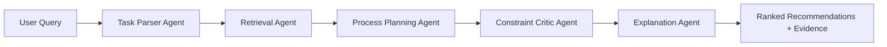

# OpenAqua 💧


## 🔍 Abstract

OpenAqua is a prototype research system for **water treatment trains design**. Given a user query describing source water, contaminants, treatment targets, and operational constraints, the system runs a multi-stage pipeline that parses the request, retrieves relevant evidence, proposes candidate treatment chains, critiques them against constraints, and returns ranked recommendations with supporting rationale.

The runnable product lives in [`water_treatment_agent/`](./water_treatment_agent/). The top-level [`data/`](./data/) directory contains crawler and data-preparation scripts used to build the knowledge base from unit-level treatment records and case-level EPA-style reports. In other words, this repository includes both the **research artifact** and the **data pipeline** behind it.

## 🧠 Method At A Glance



### Current pipeline

- **Task Parser Agent** converts natural-language or structured input into a validated normalized query.
- **Retrieval Agent** searches the indexed corpus and returns evidence from `kb_unit` and `kb_case`.
- **Process Planning Agent** generates candidate treatment chains using LLM planning or a template/seed fallback.
- **Critic Agent** checks candidates against operational constraints and proposes revisions or drops.
- **Explanation Agent** binds citations, computes interpretable scores, and produces final recommendation text.

## ✨ Highlights

- **FastAPI backend** for health checks, recommendation, and ingest workflows.
- **Streamlit GUI** for interactive recommend, health, and ingest pages.
- **RAG-style evidence pipeline** backed by indexed treatment knowledge and real-world case material.
- **Graceful degradation** when no OpenRouter key is provided: rule- and template-based fallbacks remain available.
- **Data engineering workflow** for crawling, cleaning, and validating unit-level and case-level knowledge assets.

## 🗂️ Repository Layout

```text
OpenAqua/
├── README.md
├── data/
│   ├── code/                  # crawler + cleaning scripts for raw KB construction
│   ├── case-level/            # raw case-study assets
│   └── unit-level/            # raw unit-level treatment assets
├── test_openaqua.py           # standalone benchmark utility
├── test_retrieval.py          # standalone retrieval benchmark utility
└── water_treatment_agent/
    ├── app/
    │   ├── agents/            # parser, retrieval, planner, critic, explainer
    │   ├── api/               # FastAPI entrypoint and routes
    │   ├── core/              # schemas, config, taxonomy, rules, logging
    │   ├── rag/               # index builder and retriever
    │   ├── utils/             # scoring, evidence binding, helpers
    │   └── workflows/         # end-to-end pipeline orchestration
    ├── data/                  # app-ready KB, indexes, ingest artifacts, run outputs
    ├── gui/                   # Streamlit app
    ├── scripts/               # build indexes, parse cases, run demo
    ├── tests/                 # pytest suite
    ├── requirements.txt
    └── .env.example
```

## 🚀 Quick Start

### 1. Set up the environment

```bash
cd water_treatment_agent
python -m venv .venv

# macOS / Linux
source .venv/bin/activate

# Windows
.venv\Scripts\activate

pip install -r requirements.txt
cp .env.example .env
```

### 2. Configure LLM access (optional but recommended)

Edit `water_treatment_agent/.env` and set:

```bash
OPENROUTER_API_KEY=sk-or-v1-your-key-here
```

Without an API key, the project still runs with fallbacks, but natural-language parsing and explanation quality are more limited.

### 3. Build indexes

```bash
python scripts/build_indexes.py
```

### 4. Launch the backend

```bash
uvicorn app.api.main:app --reload --host 0.0.0.0 --port 8000
```

Open API docs at `http://localhost:8000/docs`.

### 5. Launch the GUI

In a second terminal:

```bash
cd water_treatment_agent
streamlit run gui/app.py
```
## 📊 Raw data and WContBench

Raw data and WContBench are available at huggingface [https://huggingface.co/datasets/zhaorui-bi/OpenAqua](https://huggingface.co/datasets/zhaorui-bi/OpenAqua)

## 📡 API Surface

| Method | Endpoint | Status | Notes |
| --- | --- | --- | --- |
| `GET` | `/health` | Ready | Reports service, index, and LLM configuration status |
| `POST` | `/recommend` | Ready | Runs the full recommendation pipeline |
| `POST` | `/ingest` | Ready | Saves a new KB entry and triggers index rebuild |
| `POST` | `/evaluate` | Stub | Response model exists, but the route is not fully implemented yet |

### Example request

```bash
curl -X POST http://localhost:8000/recommend \
  -H "Content-Type: application/json" \
  -d '{
    "query": {
      "raw_query": "Groundwater with arsenic around 150 ug/L, low budget, no brine disposal",
      "source_water": "groundwater",
      "contaminants": ["arsenic"],
      "treatment_targets": {
        "arsenic_ug_L": 10,
        "compliance_standard": "WHO"
      },
      "constraints": {
        "budget": "low",
        "brine_disposal": false
      }
    },
    "top_k": 3
  }'
```

## 🧪 Data Pipeline

The repository also preserves the upstream data-building workflow under [`data/code/`](./data/code/):

- `01_crawl_cases.py` downloads case-study material.
- `02_crawl_tdb_list.py` extracts the master contaminant list.
- `03_crawl_tdb_details.py` collects detailed treatment records.
- `04_clean_and_taxonomy.py` cleans raw outputs and builds taxonomy assets.
- `05_data_quality_check.py` validates the generated data tree.

Inside [`water_treatment_agent/scripts/`](./water_treatment_agent/scripts/), the current app-facing utilities are:

- `build_indexes.py` for corpus and BM25 index construction.
- `parse_pdf_cases.py` for structuring case-study material.
- `run_full_demo.py` for end-to-end demo execution.

## 📊 Reproducibility And Testing

Run the project test suite from `water_treatment_agent/`:

```bash
pytest tests -v
```

Two additional root-level scripts, `test_openaqua.py` and `test_retrieval.py`, act more like benchmark or evaluation utilities than standard unit tests.

## 📌 Research Snapshot

| Component | Current state |
| --- | --- |
| Pipeline orchestration | Implemented in `app/workflows/pipeline.py` |
| Retrieval backend | BM25 + token-overlap scoring over a built corpus |
| User interface | Streamlit pages for recommend, health, and ingest |
| Serving layer | FastAPI app with open CORS for local development |
| Evaluation route | Declared, but still a stub |
| Knowledge assets | Large checked-in data and generated artifacts included in-repo |

## 🌊 Where To Start

- Start in [`water_treatment_agent/app/api/main.py`](./water_treatment_agent/app/api/main.py) if you want the service entry point.
- Read [`water_treatment_agent/app/workflows/pipeline.py`](./water_treatment_agent/app/workflows/pipeline.py) for the end-to-end execution flow.
- Inspect [`water_treatment_agent/app/core/schemas.py`](./water_treatment_agent/app/core/schemas.py) to understand the system contracts.
- Explore [`data/code/README.md`](./data/code/README.md) if you want the upstream crawler pipeline.
