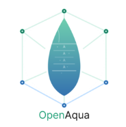
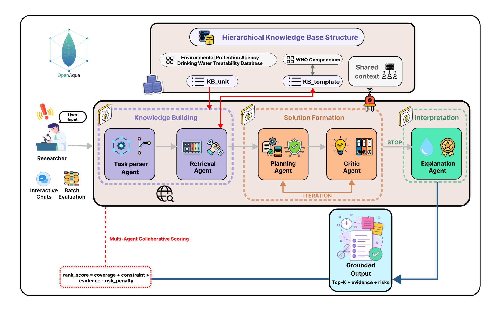

<div align="center">



**An automated multi-agent framework for early-stage water treatment train design with retrieval augmentation and critic-based refinement**

<p>
  Hanzhang Liu<sup>a,f,1</sup>,
  Zhaorui Jiang<sup>a,b,d,1,*</sup>,
  Huiling Zhong<sup>c</sup>,
  Jinshuo Li<sup>b,e</sup>,
  Wei Pang<sup>b</sup>,
  Yingfang Yuan<sup>b,*</sup>
</p>
<p>
  <sup>1</sup> Equal contribution &nbsp;&nbsp;|&nbsp;&nbsp;
  <sup>*</sup> Corresponding authors: Zhaorui Jiang, Yingfang Yuan
</p>

<br/>

[](https://github.com/zhaorui-bi/OpenAqua/releases/tag/v1.0.0)
[](https://github.com/zhaorui-bi/OpenAqua/stargazers)
[](./LICENSE)
[](https://www.python.org/)
[](https://huggingface.co/datasets/zhaorui-bi/OpenAqua)

[](./water_treatment_agent/app/api)
[](./water_treatment_agent/gui)
[](./water_treatment_agent/app/rag)
[](./water_treatment_agent/app/agents)
[](https://huggingface.co/datasets/zhaorui-bi/OpenAqua/tree/main/WContBench)
[](./water_treatment_agent/.env.example)

<p>
  <a href="https://github.com/zhaorui-bi/OpenAqua/releases/tag/v1.0.0"><b>Release</b></a> ·
  <a href="https://huggingface.co/datasets/zhaorui-bi/OpenAqua"><b>Dataset</b></a> ·
  <a href="#installation"><b>Installation</b></a> ·
  <a href="#quick-start"><b>Quick Start</b></a> ·
  <a href="#evaluation"><b>Evaluation</b></a> ·
  <a href="#citation"><b>Citation</b></a>
</p>


<p><em>Figure 1. OpenAqua framework: a five-agent pipeline with retrieval augmentation and critic-based refinement.</em></p>

</div>

---

## Abstract

OpenAqua is a research system for **early-stage water treatment train design**. Given source water, target contaminants, effluent goals, and operating constraints, a five-agent pipeline parses the request, retrieves unit-level and case-level evidence, proposes taxonomy-constrained process chains, critiques them against hard engineering rules, and returns ranked recommendations with citations.

The runnable system lives in [`water_treatment_agent/`](./water_treatment_agent/). Raw knowledge assets, processed corpora, and the **WContBench** benchmark are hosted on Hugging Face:

> **[huggingface.co/datasets/zhaorui-bi/OpenAqua](https://huggingface.co/datasets/zhaorui-bi/OpenAqua)**

## News

- **[2026-08]** **v1.0.0** released. See the [release notes](https://github.com/zhaorui-bi/OpenAqua/releases/tag/v1.0.0).
- **[2026-08]** Knowledge base, raw crawls, and WContBench are served from the [Hugging Face dataset](https://huggingface.co/datasets/zhaorui-bi/OpenAqua).
- **[2026-03]** OpenAqua code and WContBench released.

## Highlights

| | |
| --- | --- |
| **Five specialized agents** | Parser, Retriever, Planner, Critic, and Explainer run as a typed pipeline with an optional critic–planner retry loop. |
| **Dual knowledge base** | Unit-level treatment records (TDB) plus case-level plant reports, indexed for hybrid retrieval. |
| **Taxonomy lock** | Candidate units must come from the controlled process vocabulary; unknown units are dropped, not silently kept. |
| **Constraint critic** | Rule library checks disinfection, brine disposal, energy, and taxonomy compliance, then auto-revises when possible. |
| **Interpretable ranking** | Score = coverage (0.35) + constraint (0.30) + evidence (0.25) − risk. |
| **Graceful degradation** | Without an OpenRouter key the system still runs via rule- and template-based fallbacks. |
| **WContBench** | 337 design cases in Easy / Middle / Difficult splits, with gold trains and evidence lists. |

## Framework

The overview figure above is the system architecture. Agents run as a typed pipeline; the critic can send failed trains back to the planner when every candidate is dropped.

| Agent | Role |
| --- | --- |
| **Parser** | Maps free-text or structured input to a `NormalizedQuery` (source, contaminants, targets, constraints). |
| **Retriever** | Hybrid BM25 + token-overlap search over unit and case corpora. |
| **Planner** | Generates candidate trains inside the process taxonomy, using retrieved cases as context. |
| **Critic** | Applies the rule library; auto-fixes missing disinfection / brine conflicts; drops remaining failures. |
| **Explainer** | Binds evidence, computes the decomposed rank score, and writes a rationale with uncertainty. |

Serving stack:

- **FastAPI** — `GET /health`, `POST /recommend`, `POST /ingest`
- **Streamlit** — recommend / health / ingest pages
- **LLM** — OpenRouter (`anthropic/claude-3-haiku` default; stronger models for planning and explanation)

## Dataset and Benchmark

All data are on Hugging Face, not in this Git repository.

<p>
  <a href="https://huggingface.co/datasets/zhaorui-bi/OpenAqua">
    
  </a>
</p>

| Asset | Path on Hub | Contents |
| --- | --- | --- |
| Processed knowledge base | [`data.zip`](https://huggingface.co/datasets/zhaorui-bi/OpenAqua/blob/main/data.zip) | App-ready unit-level TDB, taxonomy, and case KB |
| Raw crawls | [`RawData.zip`](https://huggingface.co/datasets/zhaorui-bi/OpenAqua/blob/main/RawData.zip) | Source crawls used to build the KB |
| WContBench Easy | [`WContBench/WContBench_Easy`](https://huggingface.co/datasets/zhaorui-bi/OpenAqua/tree/main/WContBench/WContBench_Easy) | 92 single-contaminant / conventional cases |
| WContBench Middle | [`WContBench/WContBench_Middle`](https://huggingface.co/datasets/zhaorui-bi/OpenAqua/tree/main/WContBench/WContBench_Middle) | 117 multi-constraint cases |
| WContBench Difficult | [`WContBench/WContBench_Difficult`](https://huggingface.co/datasets/zhaorui-bi/OpenAqua/tree/main/WContBench/WContBench_Difficult) | 128 high-conflict design cases |

Each WContBench item is a JSON case with:

- influent quality, treatment goal, and engineering constraints
- gold ranked process trains with unit functions
- evidence lists and evaluation targets (rank pattern, constraint fit, grounding)

### Download

```bash
# Option A — Hugging Face CLI
pip install -U "huggingface_hub[cli]"
huggingface-cli download zhaorui-bi/OpenAqua --repo-type dataset --local-dir ./hf_openaqua

# Option B — snapshot in Python
python - <<'PY'
from huggingface_hub import snapshot_download
snapshot_download(
    repo_id="zhaorui-bi/OpenAqua",
    repo_type="dataset",
    local_dir="./hf_openaqua",
)
PY
```

Place the processed KB where the agent expects it, then build indexes:

```bash
mkdir -p water_treatment_agent/data
unzip hf_openaqua/data.zip -d water_treatment_agent/data
cd water_treatment_agent
python scripts/build_indexes.py
```

Keep `hf_openaqua/WContBench/` for evaluation. `RawData.zip` is optional and only needed if you want the original crawl tree.

## Installation

```bash
git clone https://github.com/zhaorui-bi/OpenAqua.git
cd OpenAqua/water_treatment_agent

python -m venv .venv
source .venv/bin/activate          # Windows: .venv\Scripts\activate
pip install -r requirements.txt
cp .env.example .env
```

Edit `.env` and set an OpenRouter key if you want LLM parsing / planning / explanation:

```bash
OPENROUTER_API_KEY=sk-or-v1-your-key-here
```

Without a key the pipeline still runs, with lower-quality natural-language parsing and template explanations.

## Quick Start

### 1. Data and indexes

Download the dataset (see above), unzip `data.zip` into `water_treatment_agent/data/`, then:

```bash
cd water_treatment_agent
python scripts/build_indexes.py
```

### 2. API

```bash
uvicorn app.api.main:app --reload --host 0.0.0.0 --port 8000
```

Docs: [http://localhost:8000/docs](http://localhost:8000/docs)

| Method | Endpoint | Status |
| --- | --- | --- |
| `GET` | `/health` | Ready — service, index, and LLM flags |
| `POST` | `/recommend` | Ready — full five-agent pipeline |
| `POST` | `/ingest` | Ready — add a KB entry and rebuild indexes |
| `POST` | `/evaluate` | Stub — response model only |

```bash
curl -X POST http://localhost:8000/recommend \
  -H "Content-Type: application/json" \
  -d '{
    "query": {
      "raw_query": "Groundwater with arsenic around 150 ug/L, low budget, no brine disposal",
      "source_water": "groundwater",
      "contaminants": ["arsenic"],
      "treatment_targets": {
        "arsenic_ug_L": 10,
        "compliance_standard": "WHO"
      },
      "constraints": {
        "budget": "low",
        "brine_disposal": false
      }
    },
    "top_k": 3
  }'
```

### 3. GUI

```bash
cd water_treatment_agent
streamlit run gui/app.py
```

### 4. Offline demo

```bash
cd water_treatment_agent
python scripts/run_full_demo.py
```

## Evaluation

WContBench scoring does **not** require exact full-chain match. Predicted units are compared to the reference key units after synonym canonicalization.

| Script | Metrics |
| --- | --- |
| [`test_openaqua.py`](./test_openaqua.py) | Precision, Recall, F1, Coverage, Hit Rate, Case-level Acceptability (CLA) |
| [`test_retrieval.py`](./test_retrieval.py) | Precision@k, Recall@k, Hit@k against gold `evidence_list` |

```bash
# Treatment-train evaluation
python test_openaqua.py \
  --benchmark-dir hf_openaqua/WContBench/WContBench_Easy \
  --predictions predictions.json \
  --output eval_easy.json

# Retrieval evaluation
python test_retrieval.py \
  --benchmark-dir hf_openaqua/WContBench/WContBench_Easy \
  --predictions retrieval_preds.json
```

Write a starter prediction file:

```bash
python test_openaqua.py --write-example-predictions example_preds.json
```

Unit tests (no Hugging Face download required for schema / rule checks):

```bash
cd water_treatment_agent
pytest tests -v
```

## Repository

```text
OpenAqua/
├── assets/                      # logo + framework figure (paper-resolution + web preview)
├── CHANGELOG.md
├── test_openaqua.py             # WContBench train-level metrics
├── test_retrieval.py            # WContBench retrieval metrics
└── water_treatment_agent/
    ├── app/
    │   ├── agents/              # parser, retrieval, planner, critic, explainer
    │   ├── api/                 # FastAPI entrypoint and routes
    │   ├── core/                # schemas, config, taxonomy, rules
    │   ├── rag/                 # corpus builder, hybrid retriever, reranker
    │   ├── utils/               # scoring, evidence binding
    │   └── workflows/           # end-to-end orchestration
    ├── gui/                     # Streamlit recommend / health / ingest
    ├── scripts/                 # build_indexes, parse_pdf_cases, run_full_demo
    ├── tests/
    ├── requirements.txt
    └── .env.example
```

After dataset download, the runtime tree is:

```text
water_treatment_agent/data/
├── unit-level/tdb/              # from data.zip
├── unit-level/taxonomy.json
├── case-level/kb_cases.json
└── processed/indexes/           # created by scripts/build_indexes.py
```

## Citation

If you use OpenAqua or WContBench, please cite:

```bibtex
@article{liu2026openaqua,
  title   = {OpenAqua: An automated multi-agent framework for
             early-stage water treatment train design with retrieval
             augmentation and critic-based refinement},
  author  = {Liu, Hanzhang and Jiang, Zhaorui and Zhong, Huiling
             and Li, Jinshuo and Pang, Wei and Yuan, Yingfang},
  year    = {2026},
  note    = {Equal contribution: Hanzhang Liu and Zhaorui Jiang.
             Corresponding authors: Zhaorui Jiang and Yingfang Yuan.
             Code: https://github.com/zhaorui-bi/OpenAqua.
             Dataset: https://huggingface.co/datasets/zhaorui-bi/OpenAqua}
}
```
## License

This project is released under the [MIT License](./LICENSE). Dataset files on Hugging Face follow the same MIT license.

## Acknowledgements

OpenAqua builds on public water-treatment guidance and case material (including EPA-style reports and unit-process records). LLM calls go through [OpenRouter](https://openrouter.ai/). Retrieval uses BM25 over a locally built corpus.

<div align="center">
<br/>

[](https://huggingface.co/datasets/zhaorui-bi/OpenAqua)
[](https://github.com/zhaorui-bi/OpenAqua)

<sub>OpenAqua · multi-agent water treatment train design</sub>

</div>
